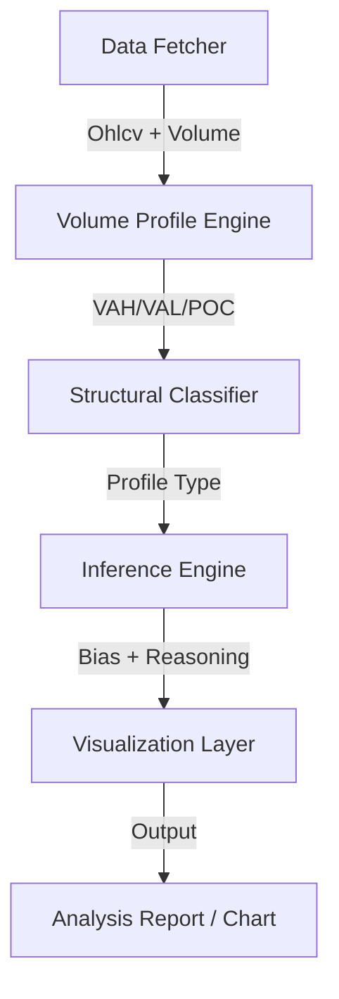

# Auction Context Engine (ACE)

A computational market structure analysis system that models financial markets using **Auction Market Theory (AMT)** and prior-session volume distribution.

[](https://www.python.org/downloads/)
[](LICENSE)

---

## 📌 Overview

This project applies a **data-driven market structure framework** to analyze how price interacts with volume-based value zones from the prior trading session. 

Instead of treating price as random movement, the system models it as an **auction process**, where market participants establish acceptance and rejection zones over time. The output is a structured interpretation of market state and directional bias for the current session.

---

## 🎯 Problem Statement

Financial markets are often traded without structured contextual understanding. Most traders fail to account for:
- Historical value distribution
- Market acceptance vs rejection zones
- Structural regime (trend vs balance)
- Failure or continuation of breakout behavior

This leads to inconsistent decision-making. **ACE** solves this by providing an objective, rule-based context for every session.

---

## 🧩 System Architecture



---

## 🧠 Methodological Framework

### 1. Market as an Auction Process
The model assumes that price discovery follows an auction mechanism where:
- **High Volume Nodes (HVN)**: Represent accepted value / fair price.
- **Low Volume Nodes (LVN)**: Represent rejection zones / unfair price.

### 2. Volume Distribution Modeling
The prior session is transformed into a **discrete volume profile distribution**, using:
- **POC (Point of Control)**: The price level with the highest volume concentration.
- **VAH / VAL (Value Area High/Low)**: The boundaries containing 70% of the session's volume.

### 3. Structural Classification
Profiles are categorized into distinct regimes using peak detection and skewness analysis:
- **Balanced**: Rotational, mean-reverting.
- **Top/Bottom Heavy**: Skewed towards one extreme, indicating directional pressure.
- **Double/Triple Distribution**: Multi-modal days representing trend-legs or shifts in value.
- **Thin/Low-Conviction**: Low participation, high volatility risk.

---

## ⚙️ Key Features

- **📊 CME-Style Sessions**: Automatic segmentation (18:00 → 16:59 EST) for futures markets.
- **📈 Advanced Profiling**: 70% Value Area calculation with customizable binning.
- **🧩 Multi-Peak Detection**: Scipy-powered signal processing to identify multi-distribution profiles.
- **🧠 Rule-Based Inference**: Maps current price location relative to prior value to determine bias.
- **📉 Visual Analytics**: Generates annotated charts showing levels, profile, and reasoning.

---

## 📊 Usage & Interpretation

### Running the Analysis
```bash
# Default (ES=F)
python main.py

# Specific Ticker
python main.py NQ=F
```

### Interpretation Scenarios
| Scenario | Logic | Bias |
| :--- | :--- | :--- |
| **Trend Continuation** | Price holding above VAH in a top-heavy structure | **Bullish** |
| **Value Rejection** | Price falling below POC in a top-heavy profile | **Bearish** |
| **Rotational** | Price oscillating within VAH-VAL range | **Neutral** |

---

## 🛠️ Installation

1. **Clone the repository**
   ```bash
   git clone https://github.com/fh-trades/auction-context-engine.git
   cd auction-context-engine
   ```

2. **Install dependencies**
   ```bash
   pip install -r requirements.txt
   ```

---

## 📄 License
This project is licensed under the MIT License - see the [LICENSE](LICENSE) file for details.
