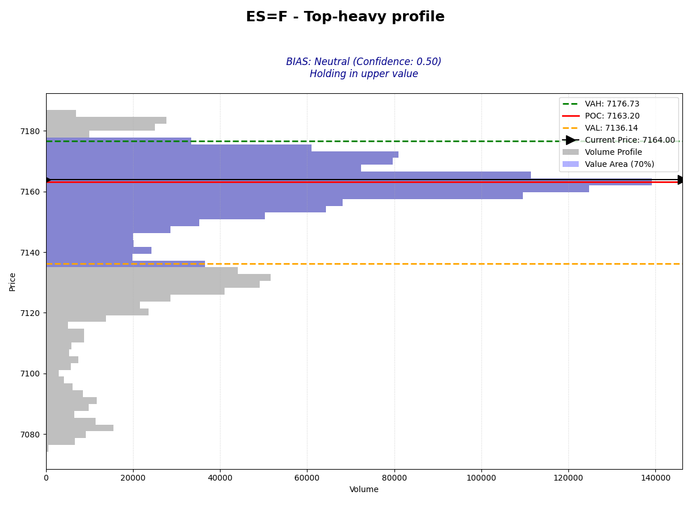
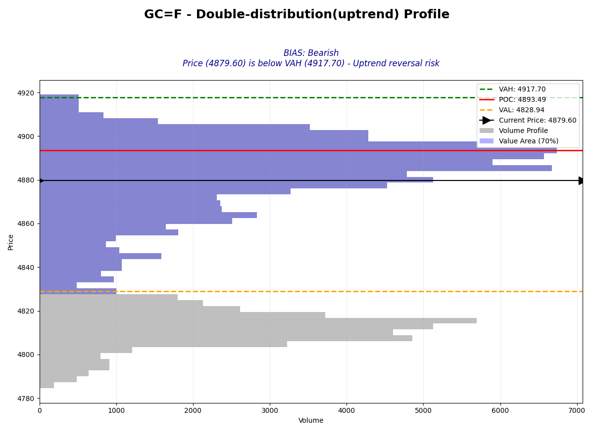

# Auction Context Engine

A systematic trading tool that analyzes **prior session volume profile** to generate actionable intraday market bias using **Auction Market Theory (AMT)**.

---

## 🚀 What This Solves

Most traders lack **context**.

They enter trades without knowing:
- Where value is established
- Whether the market is trending or balancing
- If a breakout is likely to continue or fail

👉 This tool provides that missing context.

---

## 🧠 Core Idea

Markets operate as auctions.

By analyzing the **prior session's volume distribution**, we can identify:
- Key acceptance/rejection levels (VAH, VAL, POC)
- Market structure (balanced vs trending)
- Likely behavior for the current session

---

## ⚙️ Features

- **Prior Session Analysis (CME-style)**
  - Accurate session timing (18:00 → 16:59 EST)
  - No multi-day contamination

- **Volume Profile Engine**
  - Calculates VAH, VAL, POC using 70% value area logic
  - Distributes volume across price ranges

- **Advanced Profile Classification**
  - Balanced (D-shape)
  - Top-heavy (P-shape)
  - Bottom-heavy (b-shape)
  - Double / Triple Distribution
  - Thin (Trend) Profiles

- **Context-Based Bias Engine**
  - Rule-driven logic based on structure + price location
  - Outputs:
    - Bullish / Bearish / Neutral
    - Clear reasoning

- **Visualization**
  - Clean volume profile charts
  - Highlighted value areas
  - Bias and reasoning overlay

---

## 📊 Example Output

When you run the analyzer, it generates a visual report:

### Nasdaq (NQ)


### S&P 500 (ES)


### Gold (GC)


---

## 📈 How Traders Can Use This

This tool helps answer key intraday questions:

- Is the market likely to **trend or rotate**?
- Should I trade **breakouts or mean reversion**?
- Is the current move **acceptance or rejection**?

### Example Interpretations:

- **Price above VAH → Bullish continuation**
- **Top-heavy profile + price below POC → Bearish bias**
- **Balanced profile → Expect range behavior unless breakout**

---

## 🛠️ Installation

1. Clone this repository:
   ```bash
   git clone https://github.com/fh-trades/auction-context-engine.git
   cd auction-context-engine
   ```

2. Install dependencies:
   ```bash
   pip install -r requirements.txt
   ```

---

## 📁 Project Structure

- `main.py`: Core orchestration and CLI.
- `classifier.py`: Structural profile detection (Peak-detection & VA analysis).
- `bias_analyzer.py`: Rules-based bias engine.
- `volume_profile.py`: Calculation engine for POC, VAH, and VAL.
- `visualizer.py`: Matplotlib-based charting.
- `utils.py`: Futures session and timeframe logic.

---

## ⚖️ License
MIT License - Feel free to use and modify!
