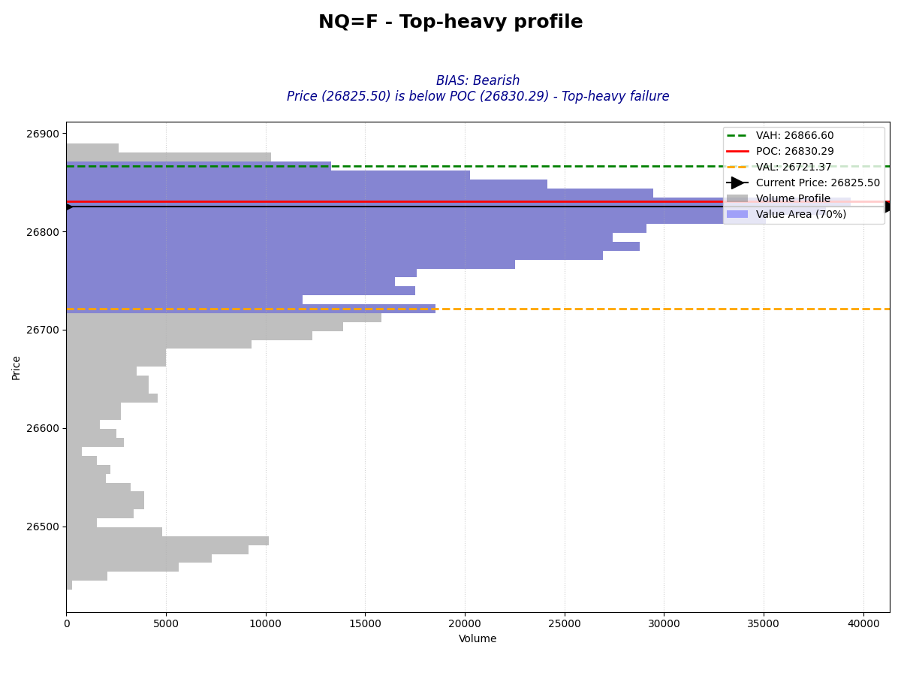

# Future Market Bias Analyzer

An automated tool for futures market analysis based on **Volume Profile** structures and **Prior Day** session dynamics.

## 🚀 Overview

This tool identifies daily market bias by analyzing the prior day's trading volume distribution. It classifies market structures into 8 distinct profile types and applies a rules-based bias engine to determine if the current market is **Bullish**, **Bearish**, or **Neutral**.

### Key Features
- **Automated Data Fetching**: Real-time integration with Yahoo Finance for futures (ES, NQ, CL, etc.).
- **Profile Classification**: Advanced peak-detection algorithm to identify:
  - Balanced (D-shape)
  - Top-heavy (P-shape)
  - Bottom-heavy (b-shape)
  - Double & Triple Distributions
  - Thin (Trend) Profiles
- **Bias Reasoning Engine**: Provides clear, logical explanations for every bias result (e.g., *"Price is holding between POC and VAH"*).
- **Visual Analytics**: Automatically generates high-resolution Volume Profile charts with highlighted Value Areas and logic overlays.

---

## 📊 Sample Output

When you run the analyzer, it generates a visual report:



---

## 🛠️ Installation

1. Clone this repository:
   ```bash
   git clone https://github.com/fh-trades/market-bias-analyzer.git
   cd market-bias-analyzer
   ```

2. Install dependencies:
   ```bash
   pip install -r requirements.txt
   ```

---

## 📖 Usage

Run the analysis for any futures ticker (e.g., ES=F, NQ=F, GC=F, CL=F):

```powershell
python main.py NQ=F
```

---

## 🧠 Bias Logic

The tool applies specific rules based on the detected profile:

- **Top-heavy**: Bullish if price > VAH, Bearish if price < POC.
- **Bottom-heavy**: Bullish if price > POC, Bearish if price < VAL.
- **Double/Triple Distributions**: Trend continuation vs. Reversal risk logic.
- **Balanced**: Standard Value Area breakout logic.

---

## 📁 Project Structure

- `main.py`: Core orchestration and CLI.
- `classifier.py`: Structural profile detection (Peak-detection & VA analysis).
- `bias_analyzer.py`: Rules-based bias engine.
- `volume_profile.py`: Calculation engine for POC, VAH, and VAL.
- `visualizer.py`: Matplotlib-based charting.
- `utils.py`: Futures session and timeframe logic.

---

## ⚖️ License
MIT License - Feel free to use and modify!
